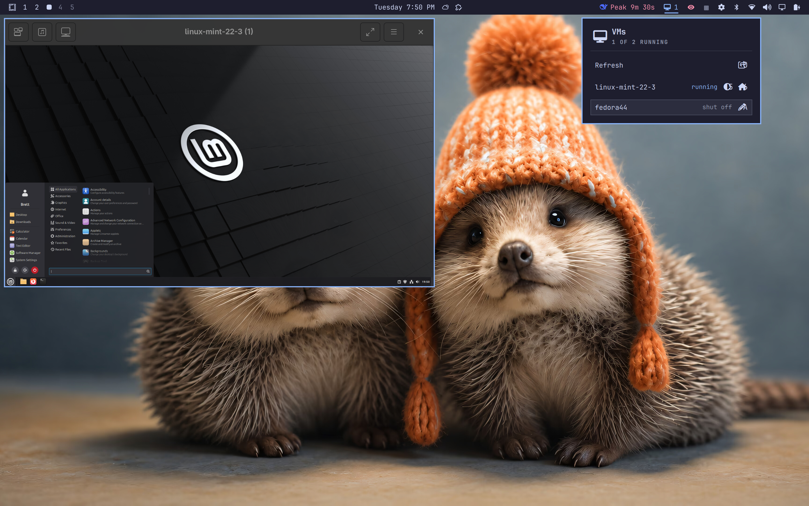
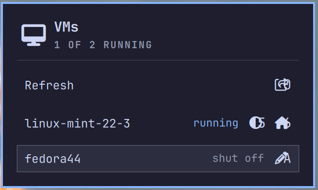

# VMaker

Interactive QEMU/KVM + libvirt VM creation for Arch/Omarchy, plus a bar
widget to list and start/stop your VMs.

## Preview





| Path | What it is |
|------|-----------|
| `manifest.json`, `*.qml`, `lib/` | The `vmaker.vms` plugin (manifest at the repo root) |
| `vmaker` | Interactive CLI that creates VMs (asks OS, name, ISO, CPU, RAM, disk) |
| `vmakerSetup.sh` | One-shot installer for QEMU/libvirt, vmaker, and the plugin |

## Requirements

- Arch Linux or Omarchy (uses `pacman`)
- `sudo` access — the setup script asks for your password

## Install

### Quick start (recommended)

```bash
git clone https://github.com/C0d3C0r34u5/VMaker.git
cd VMaker
./vmakerSetup.sh
```

This installs QEMU, libvirt, and their dependencies, enables `libvirtd`,
starts the default NAT network, adds your user to the `libvirt` and `kvm`
groups, installs `vmaker` to `~/.local/bin`, and installs + enables the
`vmaker.vms` bar widget.

When it finishes, **log out and back in** so the new group membership takes
effect, then run `vmaker` to create your first VM.

### Running vmakerSetup.sh after the plugin is already installed

If `vmaker.vms` is already in `~/.config/omarchy/plugins/` (you copied it,
or installed it through a plugin manager), you still need the system pieces
— QEMU, libvirt, and the `vmaker` helper. Clone the repo and run the same
setup script:

```bash
git clone https://github.com/C0d3C0r34u5/VMaker.git
cd VMaker
./vmakerSetup.sh
```

The script is idempotent, so running it again is safe:

- already-installed packages are skipped (`pacman --needed`)
- `libvirtd` and the default network are just re-enabled
- re-copying `vmaker.vms` over itself is harmless
- your user is only added to the groups if missing

After it finishes, log out and back in.

### Install only the plugin (no system changes)

Because `manifest.json` sits at the repo root, you can add it directly:

```bash
omarchy plugin add https://github.com/C0d3C0r34u5/VMaker.git --enable --yes
```

> ⚠️ **The plugin is just the bar widget** — it needs QEMU/libvirt to do
> anything, so it will show "Unavailable" until those are installed. After
> installing, run the bundled setup script (it's included in the plugin
> directory):
>
> ```bash
> ~/.config/omarchy/plugins/vmaker.vms/vmakerSetup.sh
> ```
>
> then **log out and back in**. That installs QEMU/libvirt, `vmaker`, and
> configures everything.

## Running vmakerSetup.sh

```bash
./vmakerSetup.sh            # install for real
./vmakerSetup.sh --dry-run  # print what would happen, change nothing
```

You'll be asked for your sudo password once, up front. The script then does
six things:

1. Installs packages: `qemu-desktop libvirt virt-install virt-manager
   virt-viewer edk2-ovmf dnsmasq swtpm iptables-nft libosinfo`
2. `systemctl enable --now libvirtd`
3. Starts and autostarts the default NAT network (`virbr0`)
4. Adds your user to the `libvirt` and `kvm` groups
5. Creates `~/Myvms` and grants the qemu process access to it (POSIX ACLs)
6. Installs `vmaker` to `~/.local/bin` and `vmaker.vms` into the shell

## Creating a VM

```bash
vmaker
```

`vmaker` interactively asks for: OS type (Linux/Windows), version, name,
install ISO, CPU cores, RAM, and disk size. VMs live in
`~/Myvms/<name>/<name>.qcow2`. Windows 11 / Server 2025 get Secure Boot +
TPM 2.0 automatically.

Useful commands afterwards:

```bash
virsh list --all       # see all VMs
virsh start <name>     # start
virsh shutdown <name>  # graceful stop
virsh destroy <name>   # force stop
virt-manager           # GUI
virt-viewer <name>     # view a running VM
```

## The bar widget

Once installed, `vmaker.vms` shows a computer glyph plus the running count in
the right section of the bar.

- **Left-click** — open the panel (list VMs, start / shutdown / force-stop)
- **Middle-click** — refresh immediately
- **`r`** (in the panel) — refresh

Manage it with:

```bash
omarchy plugin disable vmaker.vms
omarchy plugin enable  vmaker.vms
omarchy-shell vmaker.vms status
```

## Notes

- VMs use the system libvirt connection (`qemu:///system`), matching `vmaker`.
- After the first setup, **log out and back in** or `virsh`/`vmaker` won't
  have the `libvirt` group yet.
- The setup script grants the qemu user access to `~/Myvms` via ACLs. Don't
  re-lock your home directory back to `700` afterwards, or VMs won't start.
